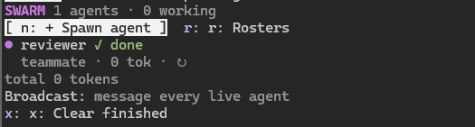
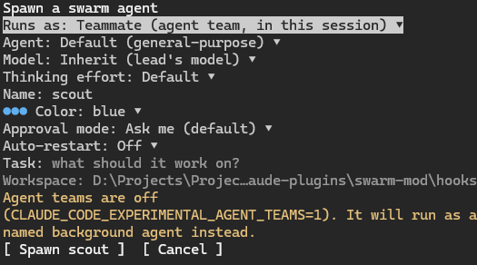

# swarm-mod

A Claude Code mod for running a swarm of agents from a side pane. You spawn agents, watch their live state and token use, answer their approvals and questions, and message them, all from the session you started in.

| Swarm pane | Spawn form |
|---|---|
|  |  |

Supports **Windows** and **macOS** (Linux best effort). Tested with Claude Code **v2.1.289** on Windows 11 (PowerShell 7 and Windows Terminal). The macOS paths are covered by unit tests, and the generated launch script was checked with a POSIX shell, but they haven't been run on a Mac yet.

## Install

This repo is a Claude Code plugin marketplace. Inside Claude Code:

```text
/plugin marketplace add netgfx/claude-swarm-mod
/plugin install swarm-mod@claude-swarm-mod
```

Or from a shell:

```shell
claude plugin marketplace add netgfx/claude-swarm-mod
claude plugin install swarm-mod@claude-swarm-mod
```

Restart Claude Code (or run `/reload-plugins`), then type `/swarm`. To get updates later, run `claude plugin marketplace update claude-swarm-mod`.

For teammates that join this session's agent team, also set `CLAUDE_CODE_EXPERIMENTAL_AGENT_TEAMS=1` (see [Transports](#transports)). To run it from a local checkout instead, see [Load it from a checkout](#load-it-from-a-checkout).

## What it does

| Feature | How |
|---|---|
| **Spawn Agent** button | The `n: + Spawn agent` button in the swarm pane, `+ Spawn agent` in the band above the prompt, or `/swarm spawn`. |
| Spawn form | Transport (teammate or separate session), agent type (built-ins plus `~/.claude/agents` and `.claude/agents` files, plus any type Claude Code offers, including plugin agents), model, thinking effort, instance name (unique, suggested for you), color (suggested at random from a 12-color palette, never one a live agent already has), approval mode, and an optional first task. |
| Same workspace | Every agent starts in the lead session's working directory. Teammates share the lead's process. Separate sessions `Set-Location` / `cd` there before `claude` starts. |
| Live state | `starting`, `working` (with the current tool, such as `Bash: npm test`), `waiting`, `idle`, `done`, `failed`, `stopped`, `exited`, `no heartbeat`, plus **! needs approval** and **? has a question**. |
| Token use | Per agent: total, input, output, cache read, cache write, current context size, and turn count. Plus a swarm total. |
| Agent view | Click a name to open its panel. On a wide fullscreen terminal it's a docked side panel; otherwise it opens inline in the main area. `e` expands it (with the teammate's conversation), `c` / Esc closes it and restores the normal layout. A separate session also has `w: Open its window`, which brings its exact tab forward: by tty in Terminal.app or iTerm2 on macOS, by window title on Windows. |
| Spawn errors | A failed agent's row shows a short `failed · copy error` button. Pressing it copies the whole error to the clipboard (or press `o` in its panel), so a long `InputValidationError` isn't cut off. |
| Needs-you icon | A red `! review` / magenta `? answer` button on the agent's row and in the band, plus a toast. Its panel has **Approve / Deny / Use its own prompt**, or the question's options plus a free-text "Other". |
| Messaging | Message one agent from its panel, or broadcast to every live agent. This uses cross-session messaging (`$.session.send`): `{ agentId }` for teammates, `{ sessionId }` for separate sessions. |
| Kill / interrupt | Per agent, `k: Kill`. Teammates are stopped with `TaskStop`. A separate session's process is ended by its PID (`taskkill /T /F` on Windows, `kill -TERM` on macOS), after checking that the PID still belongs to `claude`, so a reused PID is never killed. If that check fails, the session ends itself. `i: Interrupt` stops only the current turn. |
| **Kill all** | `k: Kill all` in the swarm pane (press twice within 6 s to confirm), or `/swarm kill-all`. Pending approvals are denied so nothing waits on a dead agent, and killed agents are never auto-restarted. |
| **Auto-restart** | Off by default. Turn it on in the spawn form or with `a` in an agent's panel. A teammate that **failed**, or a separate session that **crashed**, **exited unexpectedly**, or **hung** (no heartbeat for a full minute of the main session's own time, so waking from sleep doesn't count), comes back with the same name, color, model, effort, approval mode and task. The task is prefixed with a note to check the workspace first. The backoff is 5 s, 15 s and 45 s, for up to 3 restarts. A hung session is killed first. Kill, `/exit`, and the agent panel's stop are treated as deliberate and never undone. `p: Respawn` brings back any stopped agent by hand. |
| **Saved rosters** | `r: Rosters` (or `/swarm rosters`) saves the current swarm under a name: each agent's name, color, type, model, effort, approval mode, transport, task and auto-restart. Launch a roster in any workspace with one click (or `/swarm load <name>`). Names and colors already in use are adjusted (`scout` → `scout-2`). Rosters live in the mod store, shared by every session on this machine. |
| **Restore last swarm** | Each workspace's latest swarm is saved automatically. When you start Claude Code there again, the band and the pane offer **Restore last swarm (N)** (or `/swarm restore`). |

### Transports

**Teammate (agent team).** The mod calls `$.agent.spawn({ name, subagentType, model, prompt })`. `$.agent.spawn` only accepts a model family alias (`opus`, `sonnet`, `haiku`, `fable`), so the model picked in the form (stored as a full id such as `claude-sonnet-5-5`) is mapped to its alias first; Inherit sends no model. With `CLAUDE_CODE_EXPERIMENTAL_AGENT_TEAMS=1` set, that joins this session's team. Without it, the agent runs as a named background agent that you can still message, and the form warns you. The agent's loop runs inside the lead's process, so the mod sees its model steps (tokens, plus the per-agent **effort**, applied by rewriting `turn.step`), its tool calls (activity, edited files), and its permission checks (the **approval mode**, applied in `tool.check`).

**Separate Claude Code session.** The mod writes `~/.claude/swarm-mod/launch/<id>.ps1` (Windows), `.command` (macOS), or `.sh` (Linux), then opens a terminal:

- Windows: a tab in a Windows Terminal window named `swarm` (`wt.exe -w swarm new-tab …`), or a plain console window if Windows Terminal is missing.
- macOS: a new iTerm2 window when the lead runs in iTerm2 (`TERM_PROGRAM=iTerm.app`), otherwise a new Terminal.app window (`open -a Terminal <id>.command`, which needs no permissions). The `.command` script records its own `tty` and runs `claude` through your login shell (`$SHELL -lic`; fish falls back to zsh/bash), so `claude` and `node` resolve from the PATH your shell normally has, even when the lead runs in the Desktop app.
- Linux: `x-terminal-emulator`, `gnome-terminal`, `konsole`, or `xterm`.

The new terminal runs:

```text
claude --name <name> --plugin-dir <this mod> [--agent <type>] [--model <m>] [--effort <e>]
       [--permission-mode <mode> | --dangerously-skip-permissions] --settings <worker-settings.json>
```

`--model` gets the full model id, which the CLI accepts.

`worker-settings.json` sets `crossSessionInbound: "accept"`, so the lead's messages get through whatever the worker's permission mode. The first task is passed in `SWARM_MOD_TASK` and the worker submits it itself. Neither the task nor the JSON goes on the command line, because Windows PowerShell 5.1 mangles quotes inside native arguments.

In that session the same mod runs in **worker mode**. It reports status, activity, tokens, edited files, its last answer, and any pending approval or question to `$.store` (shared by all sessions on the machine). The lead checks for updates every 1.5 s and marks a worker `no heartbeat` after 20 s of silence.

### Approval modes

| Mode | Separate session | Teammate (enforced by the mod) |
|---|---|---|
| Ask me (default) | `--permission-mode default` | Anything the lead would ask about waits in the swarm pane |
| Accept edits | `acceptEdits` | Edit, Write, and NotebookEdit allowed; the rest as default |
| Auto | `auto` | Follows the lead session's own mode |
| Plan / read-only | `plan` | Edits denied, and anything needing approval denied, with a reason Claude can act on |
| Don't ask | `dontAsk` | Anything not pre-approved is denied |
| Bypass all | `--dangerously-skip-permissions` | Everything allowed except explicit deny rules |

Claude Code can't set a teammate's permission mode at spawn time, so the mod applies the mode itself at `tool.check`, matching the check to the agent through `tool_use_id`.

A request waiting for you is held for up to 15 minutes for teammates and 3 minutes for workers. After that it falls back to Claude Code's normal prompt, in the lead for a teammate or in the worker's own window for a worker. The mod never approves anything unless you press Approve or picked the agent's approval mode yourself.

## Commands, tool, and keys

- `/swarm`: open the swarm pane.
  - `/swarm spawn`: open the spawn form.
  - `/swarm status`: print the roster.
  - `/swarm rosters`: open the rosters pane.
  - `/swarm save <name>` and `/swarm load <name>`: save or launch a roster.
  - `/swarm restore`: bring back this workspace's last swarm.
  - `/swarm kill-all`: kill every agent.
  - `/swarm band off|on`: hide or show the band.
- `/swarm-spawn`: open the spawn form.
- Tool `mcp__swarm-mod__swarm_status`: lets the lead Claude read the roster (status, activity, tokens, what's waiting on you, last answers) before it coordinates.
- Pane keys: `n` spawn, `r` rosters, `k` kill all (twice), `x` clear finished.
- Agent panel keys: `y` approve, `d` deny, `l` use its own prompt, `o` copy its error, `w` open its window, `i` interrupt, `k` kill, `p` respawn, `a` toggle auto-restart, `e` expand, `r` remove, `c` close.
- Rosters pane: type a name and press Enter to save; Launch or Delete each roster; `c` close.

## Load it from a checkout

PowerShell:

```powershell
claude plugin validate D:\Projects\Projects\claude-plugins\swarm-mod
claude --plugin-dir D:\Projects\Projects\claude-plugins\swarm-mod
# optional, for teammates:
$env:CLAUDE_CODE_EXPERIMENTAL_AGENT_TEAMS = '1'
```

Bash/Zsh:

```bash
claude plugin validate ~/mods/swarm-mod
CLAUDE_CODE_EXPERIMENTAL_AGENT_TEAMS=1 claude --plugin-dir ~/mods/swarm-mod
```

On macOS, the first time you use `w: Open its window` (or launch into iTerm2), macOS asks whether your terminal or the Claude app may control Terminal or iTerm. Allow it, or later in System Settings > Privacy & Security > Automation. Opening a Terminal.app worker doesn't need that permission.

For the Desktop app (Code tab), add the folder to `env.CLAUDE_CODE_PLUGIN_DIRS` in `~/.claude/settings.json` (paths separated by `;` on Windows, `:` on macOS), then start a new session. The sidebar docks in a fullscreen terminal at least 144 columns wide (110 once you've opened it yourself). Narrower than that, panes open inline above the prompt.

When swarm-mod is installed from the marketplace, separate-session workers get `--plugin-dir` pointing at the installed copy, so they run the same version as the lead.

## Tests

```powershell
Set-Location D:\Projects\Projects\claude-plugins\swarm-mod; claude plugin test
```

41 tests in two files cover the following. `tests/lifecycle.test.ts` covers kill-all (the two-press confirm, TaskStop, kill by PID, the reused-PID guard, a worker ending itself), the auto-restart policy (failure, deliberate exits, hang detection, backoff, the restart limit), respawn and the auto-restart toggle, saving, launching and deleting rosters (with name and color fitting), restoring the last swarm, and the new panes on both surfaces. `tests/swarm.test.ts` covers: color picking, name rules, mapping a picked model to the alias `$.agent.spawn` accepts, approval-mode decisions, quoting of the worker CLI and launch script, path conflicts, the spawn form, per-agent effort and token counting, accept-edits and plan modes, an approval held and then approved from the pane, a question answered from the pane, launches on Windows and macOS (Terminal.app and iTerm2, the login-shell script, the tty record, focus by tty with balanced AppleScript blocks, case-insensitive paths on APFS), worker reporting, lead pickup and messaging, every pane plus the band on both terminal and Desktop, and a refused spawn keeping its full error (which you can copy from the agent's row).

## Releasing

`.claude-plugin/plugin.json` is the plugin manifest and `.claude-plugin/marketplace.json` makes this repo a one-plugin marketplace (`"source": "./"`). `claude plugin validate .` checks both. When you release, bump `version` in both files so `claude plugin marketplace update` picks up the change.

## What the mod calls (from `claude plugin validate`)

`$.agent.spawn/list`, `$.session.send/messages/cwd/id`, `$.tool.call` (TaskStop), `$.tool.register`, `$.turn.abort`, `$.prompt.submit` (a worker's first task), `$.process.run` (opening terminals: `wt.exe`/`cmd start` on Windows, `open`/`osascript` on macOS; focusing windows: PowerShell `AppActivate` or `osascript`; a worker reading its own PID (`powershell` / `sh` + `ps`); killing a worker: checking the name with `Get-Process`/`ps`, then `taskkill`/`kill`; `ping`/`sleep` as a one-second wait while a request is held; `uname`; `chmod`), `$.fs.write` (launch scripts under `~/.claude/swarm-mod/launch`), `$.fs.list/read` (agent definitions, a worker's recorded tty), `$.store` (`w:<id>` worker reports, `r:<id>` lead replies and kill requests, `roster:<name>` saved rosters, `last:<workspace>` each workspace's last swarm, `band`), and `$.state` (the roster, kept across hot reloads).

Environment variables read: `OS`, `USERPROFILE`, `HOME`, `TERM_PROGRAM`, `CLAUDE_CODE_EXPERIMENTAL_AGENT_TEAMS`, and the worker's `SWARM_MOD_WORKER/LEAD/NAME/APPROVAL/TASK`.

## Extras built in

- **File-conflict radar**: when two agents edit the same file (case-insensitive on Windows and macOS, matching NTFS and APFS defaults), you get a `▲` line in the pane, a warning in each agent's panel, and a toast.
- **Broadcast** to every live agent.
- **Finished and failed** lines in each agent's log, with toasts on failures.
- **Status tool** so the lead Claude can coordinate the swarm with up-to-date information.

## Ideas for later

1. **Worktree isolation per agent**: an option to start a separate session in its own `git worktree` so edits never collide, with a merge view.
2. **Token and cost budgets**: a per-agent or swarm-wide cap that warns at 80% and interrupts at 100% (`turn.step` can refuse further steps).
3. **Task board**: show the team's shared task list (`~/.claude/tasks/<team>/`) with owners, color-coded by agent, plus drag-to-assign.
4. **File locks**: when the conflict radar fires, the second agent's edit waits for the lead's OK, not just a warning.
5. **Supervisor digest**: every N minutes, a Haiku summary of what each agent did (`$.model.complete`) in the pane.
6. **Stuck-task nudges**: ping a teammate that sits on an in-progress task too long.
7. **Pause all**: interrupt every agent's turn without killing it, then resume.
8. **Auto-launch a roster** when a workspace opens (opt-in per roster).
9. **Remote approvals from your phone** through Remote Control, using the same approval path.

## License

MIT. See [LICENSE](LICENSE).
